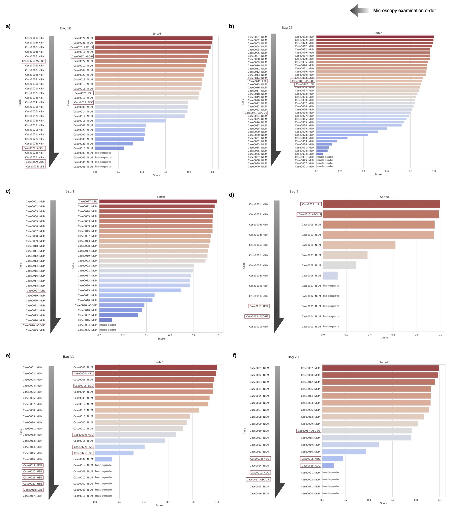

# GynAIe
<div align="center">

<picture>
  <source media="(prefers-color-scheme: light)" srcset="/assets/GynAIe_logo.PNG">
  
</picture> 

**"Magical AI for women worldwide."**

</div>

**GynAIe**: Pronounced "Genie" (/ˈdʒiːni/)  
The name **"GynAIe"** is a blend of **"Gynecology"** and **"AI"**. We've chosen to pronounce it as "Genie" (/ˈdʒiːni/) to emphasize the magical assistance it provides in the field of gynecology.


## 🤩 Updates
- **`2024/08/25`**: Added paper highlights and images!
- **`2024/08/24`**: The logo has been uploaded!
- **`2024/08/22`**: Our paper entitled "Enhancing cervical cancer cytology screening via artificial intelligence innovation" has been published in *Scientific Reports*. You can access the paper [here](https://doi.org/10.1038/s41598-024-70670-6)!

## 🙇🏻‍♂️ Note to Users
Please be advised that this project is managed solely by me. As such, updates to the code and responses to issues may take some time. I appreciate your patience and understanding as I work to make this project as useful and robust as possible. Your feedback and contributions are always welcome and highly valued.

Thank you for your support and understanding.

## ✨ Highlights
- Developed an AI-integrated workflow for cervical cytology screening that reduces screening time to approximately 10 seconds per case and significantly lessens the workload on cytologists.
- Implemented a visual language model that enhances the identification of high-risk cases by prioritizing cases based on anomaly scores and targeting review efforts accordingly.
- Demonstrated the potential of AI technology to improve the efficiency and accuracy of cytological examinations, contributing to faster diagnosis and treatment of cervical cancer.

<p>
    <picture>
        
    </picture>
</p>

<p>
    <picture>
        
    </picture>
</p>

## 📆 TODO
- [x] Publication of a paper
- [ ] Granting of a license
- [ ] Release usage documentation
  - [ ] Add requirements
  - [ ] Tile image generation code
  - [ ] Screening code
- [ ] Release Streamlit-based screening workflow

## 🎉 Citation

```
@article{kurita2024gynaie,
         title={Enhancing cervical cancer cytology screening via artificial intelligence innovation}, 
         author={Yuki Kurita et al.},
         year={2024},
         journal={Scientific Reports},
         doi={10.1038/s41598-024-70670-6}
}
```
