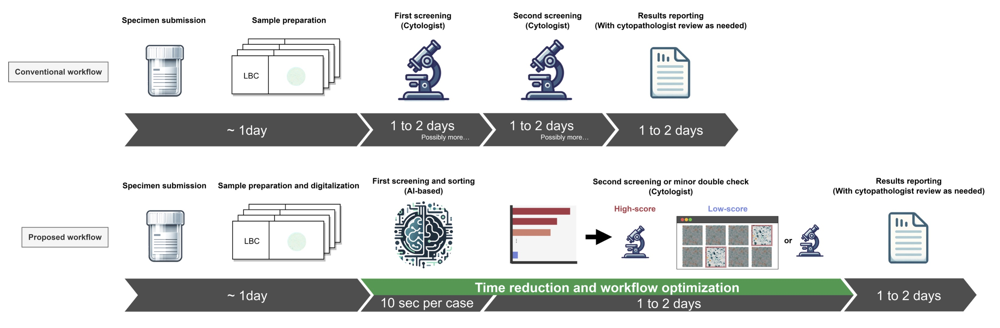

# GynAIe
<div align="center">

<picture>
  <source media="(prefers-color-scheme: light)" srcset="/assets/GynAIe_logo.PNG">
  
</picture> 

**"Magical AI for women worldwide."**

</div>

**GynAIe**: Pronounced "Genie" (/ˈdʒiːni/)  
The name **"GynAIe"** is a blend of **"Gynecology"** and **"AI"**. We've chosen to pronounce it as "Genie" (/ˈdʒiːni/) to emphasize the magical assistance it provides in the field of gynecology.


## 🤩 Updates
- **`2024/09/04`**: Released the code for conducting screening! Detailed steps on how to run the script are now available in the [Usage section](#screening) of our README.
Please refer to the Usage section to ensure your setup is correct and to effectively use the screening code.
- **`2024/09/01`**: Licensed under **Apache v2**. Please note, the model itself is licensed under **CC-BY-NC-SA-4.0**, so please be cautious about its use.
- **`2024/08/30`**: Released model! [Hugging Face Model](https://huggingface.co/kuri54/GynAIe-preview-clip-vit-large-patch14-336-8bit)
- **`2024/08/28`**: Released [part of the Usage](#generating-tile-images) documentation. This includes instructions on generating tile images from WSI using specified parameters. More detailed usage instructions will be provided in future updates.
- **`2024/08/25`**: Added paper highlights and images!
- **`2024/08/24`**: The logo has been uploaded!
- **`2024/08/22`**: Our paper entitled "Enhancing cervical cancer cytology screening via artificial intelligence innovation" has been published in *Scientific Reports*. You can access the paper [here](https://doi.org/10.1038/s41598-024-70670-6)!

## ✨ Highlights
- Developed an AI-integrated workflow for cervical cytology screening that reduces screening time to approximately 10 seconds per case and significantly lessens the workload on cytologists.
- Implemented a visual language model that enhances the identification of high-risk cases by prioritizing cases based on anomaly scores and targeting review efforts accordingly.
- Demonstrated the potential of AI technology to improve the efficiency and accuracy of cytological examinations, contributing to faster diagnosis and treatment of cervical cancer.

<p>
    <picture>
        
    </picture>
</p>

<p>
    <picture>
        
    </picture>
</p>

## Usage
It is recommended to use a virtual environment of your choice, such as Docker.

### Generating Tile Images
Access this [link](https://github.com/kuri54/Preprocessing-WSI) to generate tile images from WSI (Whole Slide Image).  
This process can also be done on a local machine, but the processing speed will depend on the CPU performance.  
<br>
The tile images in the paper were generated with the following parameters:  
```bash
python preprocessing.py -u 0.3 -s 1024  
```
<br>

### Screening
1. **Installation**: 
   - Clone this repository.
   - Navigate to the cloned directory.
      ```bash
      cd GynAIe
      ```
   - Install the necessary libraries and dependencies as listed in `requirements.txt`.
      ```bash
      pip install -r requirements.txt
      ```

2. **Arranging tile images and creating a CSV file**
   -  Organize the generated tile images as illustrated below:
        .
        └── GynAIe/
            └── input/
                ├── 20240904/
                │   ├── c202400001/
                │   │   ├── c202400001_1.jpg
                │   │   ├── c202400001_2.jpg
                │   │   └── c202400001_3.jpg
                │   └── c202400002/
                │       ├── c202400002_1.jpg
                │       ├── c202400002_2.jpg
                │       └── c202400002_3.jpg
                └── 20240904.csv

    - It is recommended to create a directory named `input`, under which you should place directories containing tile images for each screening case group.

    - Create a CSV file detailing the specifics of each case and place it in the directory where the tile images are stored. Ensure the following for the CSV file:

     - The CSV should include the following details:

     - Ensure that the column names in the CSV file are as follows: 
        | case       | age |
        | ---------- | --- |
        | c202400001 | 35  |
        | c202400002 | 88  |

3. Running the code
    To execute the model, use the following command in your terminal. This command runs the `main.py` script and specifies the input directory where your tile images are stored:

    ```bash
    python3 main.py --input_dir input/20240904
    ```


## 📆 TODO
- [x] Publication of a paper
- [x] Add paper highlights and images
- [x] Release model
- [x] Granting of a license
- [x] Release usage documentation
  - [x] Add requirements
  - [x] Tile image generation code
  - [x] Screening code
- [ ] Release Streamlit-based screening workflow

## 🎉 Citation

```
@article{kurita2024gynaie,
         title={Enhancing cervical cancer cytology screening via artificial intelligence innovation}, 
         author={Yuki Kurita et al.},
         year={2024},
         journal={Scientific Reports},
         doi={10.1038/s41598-024-70670-6}
}
```
